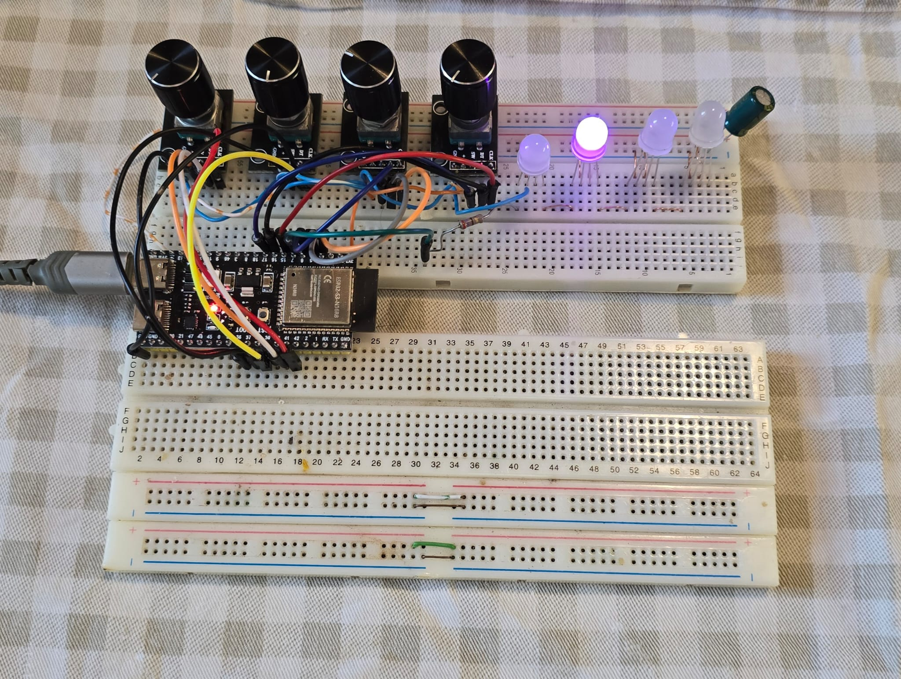
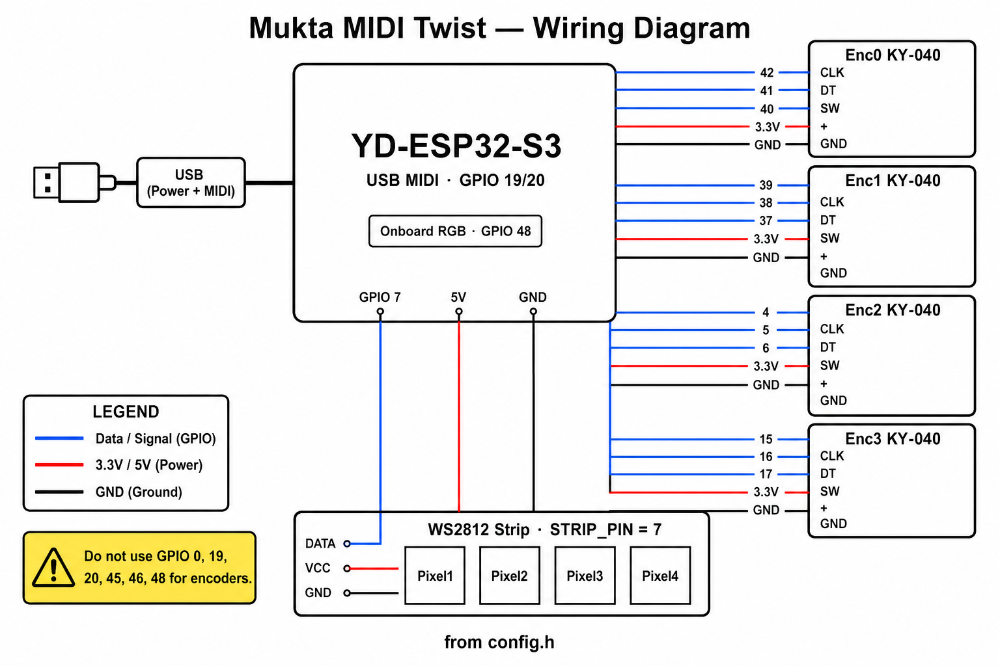

<p align="center">
  
  <br>
  <sub>© 2026 Richard Smetana · Logo generiert mit ChatGPT</sub>
</p>

# Mukta MIDI Twist

[English README](README.md)

Arduino-MIDI-Controller-Firmware für **vier KY-040**-Drehencoder mit Tastern sowie **RGB-LED-Feedback** (Onboard-WS2812 an GPIO 48 + externe Strip an GPIO 7), gesteuert über eingehende MIDI Note On / Note Off.

Auf dem **ESP32-S3** läuft MIDI über **natives USB** (class-compliant USB-MIDI-Gerät **„Mukta MIDI Twist“**). Keine Serial↔MIDI-Bridge und kein Kabeltausch für MIDI.

Zielboard: **YD-ESP32-S3** (VCC-GND Studio) oder jedes **ESP32S3 Dev Module** mit nativem USB an GPIO 19/20.

---

## Features

- Vier KY-040-Encoder, gepollt in `loop()` (keine Interrupts — stabil auf ESP32-S3)
- Absoluter und relativer CC-Modus pro Encoder
- Vier Taster (momentary und/oder latch)
- MIDI-**Empfang**: Note On/Off → Onboard-RGB (GPIO 48) + externe Strip (GPIO 7, 4 Pixel)
- Note-On-**Velocity** setzt die Kanalhelligkeit
- Alle GPIOs und MIDI-Maps in [`config.h`](config.h)

---

## Hardware

### Teile

| Teil | Hinweise |
|------|----------|
| **ESP32-S3** | YD-ESP32-S3 empfohlen |
| 4× **KY-040** | je CLK, DT, SW, +, GND |
| **WS2812-Strip** (optional) | 4× RGB, Daten an **GPIO 7** |
| **USB-Kabel** | nativer USB-Port (GPIO 19/20) — Strom, Upload, MIDI |

### YD-ESP32-S3 Lötbrücken (Unterseite)

| Brücke | Einstellung |
|--------|-------------|
| **RGB** | **geschlossen** (Onboard-LED an GPIO 48) |
| **USB-OTG** | offen (Device-Modus über Firmware) |
| **IN-OUT** | offen (5-V-Pin nur als Stromeingang) |

### Breadboard-Prototyp

<p align="center">
  
</p>

### Schaltplan / Verdrahtung (aktuelles `config.h`)

<p align="center">
  
</p>

| Signal | Enc 0 | Enc 1 | Enc 2 | Enc 3 |
|--------|-------|-------|-------|-------|
| **CLK** | **42** | **39** | **4** | **15** |
| **DT** | **41** | **38** | **5** | **16** |
| **SW** | **40** | **37** | **6** | **17** |
| **+** | 3,3 V | 3,3 V | 3,3 V | 3,3 V |
| **GND** | GND | GND | GND | GND |

| Funktion | GPIO | Hinweise |
|----------|------|----------|
| WS2812-Strip-Daten | **7** | `STRIP_PIN`, 4 LEDs, `NEO_RGB` |
| Onboard-RGB | **48** | `RGB_BUILTIN`, Brücke **RGB** geschlossen |
| BOOT / Upload | **0** | **2 s** halten für Bootloader |
| USB D− / D+ | **19 / 20** | nicht als GPIO nutzen |
| UART0 (optional) | **43 / 44** | Serial-Monitor falls nötig |
| Strapping | **45 / 46** | nicht als GPIO nutzen |

Eine Compile-Zeit-Prüfung in `config.h` stellt sicher, dass alle Encoder- und Strip-Pins eindeutig sind.

### Reservierte GPIOs (nicht in `config.h` belegen)

| GPIO | Grund |
|------|--------|
| 0 | BOOT-Taster (Upload-Trigger in der Firmware) |
| 19, 20 | natives USB |
| 45, 46 | Boot-Strapping |
| 48 | Onboard-WS2812 (außer Onboard-LED deaktiviert) |

### Freie GPIOs am YD-ESP32-S3-Header (für Erweiterungen)

Noch frei an den Headern: **1, 2, 3, 8, 9, 10, 11, 12, 13, 18, 21, 35, 36** (plus **43, 44**, falls UART0 ungenutzt).

---

## Software-Setup

### 1. Tools installieren

1. [Arduino IDE](https://www.arduino.cc/en/software) 2.x (oder Arduino CLI)
2. Board-Paket: **esp32** von **Espressif Systems** (Board Manager)
3. Library: **Adafruit NeoPixel** (Library Manager — nur für die externe Strip)

Empfohlene esp32-Core-Version: **3.3.x** (getestet mit 3.3.11).

### 2. Sketch öffnen

Ordner `mukta-midi-twist` öffnen — Sketch-Name muss dem Ordnernamen entsprechen.

### 3. Arduino IDE — Menü Werkzeuge

**Jeden** Wert unten vor Compile/Upload setzen:

| Werkzeug | Einstellung | Warum |
|----------|-------------|-------|
| **Board** | **ESP32S3 Dev Module** | ESP32-S3-Ziel |
| **USB Mode** | **USB-OTG (TinyUSB)** | natives USB-MIDI (`ARDUINO_USB_MODE=0`) |
| **USB CDC On Boot** | **Disabled** | reines MIDI-Gerät; **Enabled** bricht MIDI unter Windows |
| **USB Firmware MSC On Boot** | Disabled | — |
| **USB DFU On Boot** | Disabled | — |
| **Upload Mode** | **USB-OTG CDC (TinyUSB)** | Upload über natives USB |
| **CPU Frequency** | 240 MHz | Standard |
| **Flash Mode** | QIO 80 MHz | Modul anpassen |
| **Flash Size** | **4 MB (32 Mb)** | ggf. anpassen (z. B. 8 MB) |
| **Partition Scheme** | Default | — |
| **PSRAM** | Disabled / OPI | Modul anpassen (N8R8 → OPI PSRAM) |
| **Arduino Runs On** | Core 1 | Standard |
| **Events Run On** | Core 1 | Standard |
| **JTAG Adapter** | Disabled | außer OpenOCD-Debugging |
| **Upload Speed** | 921600 | bei Fehlern auf 115200 senken |

**Wichtig:** Bei **USB Mode = Hardware CDC and JTAG** oder **USB CDC On Boot = Enabled** zeigt Windows meist nur einen COM-Port und **kein MIDI** in Sonic Pi / DAWs.

---

## Einmalige Anpassung der Arduino-Umgebung

Nach Upload über **BOOT → USB JTAG** startet der ESP32-S3 oft **nicht** in den Sketch neu (esptool-Standard: `--after hard-reset`).

### `platform.local.txt` installieren

1. [`platform.local.txt`](platform.local.txt) aus diesem Repo kopieren nach:

   **Windows**
   ```
   %LOCALAPPDATA%\Arduino15\packages\esp32\hardware\esp32\3.3.11\platform.local.txt
   ```

   **macOS**
   ```
   ~/Library/Arduino15/packages/esp32/hardware/esp32/3.3.11/platform.local.txt
   ```

   **Linux**
   ```
   ~/.arduino15/packages/esp32/hardware/esp32/3.3.11/platform.local.txt
   ```

   `3.3.11` anpassen, falls eine andere esp32-Core-Version installiert ist (Ordnername prüfen).

2. **Arduino IDE vollständig neu starten.**

3. Im Upload-Log prüfen: `--after watchdog-reset` erscheint **vor** `write-flash` (nicht am Ende des Befehls).

**Nicht** `boards.local.txt` mit `upload.extra_flags=--after watchdog-reset` verwenden — das hängt das Flag hinter die `.bin`-Dateien und zerstört den esptool-Aufruf.

---

## Programmieren / Upload-Ablauf

Solange der MIDI-Sketch läuft, gibt es **keinen COM-Port** (`USB CDC On Boot: Disabled`). Upload läuft immer über den **ROM-Bootloader** (USB-JTAG-Port).

### Jeder Upload

1. USB am **nativen Port** (GPIO 19/20) anschließen, nicht an einem reinen UART-Anschluss.
2. **BOOT (GPIO 0) 2 Sekunden halten** — Firmware ruft `usb_persist_restart(RESTART_BOOTLOADER)` auf.
   - Alternative: **BOOT** halten, **RST/EN** tippen, **BOOT** loslassen.
3. In der Arduino IDE → **Port**: **USB JTAG/serial debug unit (COMx)** wählen.
4. **Upload** (✓) klicken.
5. Warten bis **Done uploading**.
6. **USB einmal ab-/anstecken** (Windows enumeriert MIDI neu).
7. Sonic Pi / DAW neu starten und **„Mukta MIDI Twist“** wählen.

### Was im Upload-Log stehen sollte

```
USB mode: USB-Serial/JTAG
...
--after watchdog-reset write-flash ...
...
Done uploading.
```

`USB-Serial/JTAG` während des Uploads ist **normal** (Bootloader-Modus). Nach dem Replug erscheint das Gerät als **MIDI-Instrument**, nicht als COM-Port.

### Erster Flash / gelöschter Chip

Beim allerersten Upload nach Flash-Löschung kann noch ein manueller **BOOT + RST**-Zyklus nötig sein. Mit installierter `platform.local.txt` sollten spätere Uploads ohne RST starten.

### Wenn der Upload fehlschlägt

| Symptom | Lösung |
|---------|--------|
| Port nicht gefunden | BOOT 2 s → **USB JTAG/serial debug unit** wählen |
| `Could not open COMx` | falscher Port; kein veraltetes „USB Serial Device“ einer alten Composite-Firmware |
| Upload OK, kein MIDI | **USB CDC On Boot** muss **Disabled** sein; USB repluggen; Sonic Pi neu starten |
| Upload OK, RST nötig | [`platform.local.txt`](platform.local.txt) installieren; IDE neu starten |
| Compile-Warnung CDC enabled | **USB CDC On Boot → Disabled** setzen |

---

## MIDI-Nutzung (Sonic Pi / DAW)

1. Gerätename: **Mukta MIDI Twist**
2. Windows: Geräte-Manager → **Audio-, Video- und Gamecontroller** (nicht **Anschlüsse COM & LPT**)
3. Sonic Pi: Preferences → I/O → **Mukta MIDI Twist** als Input/Output aktivieren
4. Notes **45–47** für Onboard-RGB, **48–59** für Strip-Pixel senden (Kanal **1** standardmäßig)
5. Beispiele: [`sonicpi/`](sonicpi/) — LED-Test und Drum-Track mit Encoder-Steuerung (siehe [`sonicpi/README.md`](sonicpi/README.md))

---

## Konfiguration

Nur **[`config.h`](config.h)** bearbeiten.

### GPIO-Übersicht

```cpp
// Encoder (CLK / DT / SW)
ENC0: 42 / 41 / 40
ENC1: 39 / 38 / 37
ENC2:  4 /  5 /  6
ENC3: 15 / 16 / 17

STRIP_PIN = 7        // externe WS2812, 4 LEDs
Onboard RGB: GPIO 48 // RGB_BUILTIN, nicht in config.h
```

### Onboard-RGB (GPIO 48)

| Kanal | MIDI-Note |
|-------|-----------|
| Rot | **45** |
| Grün | **46** |
| Blau | **47** |

### Externe Strip (GPIO 7, 4 Pixel)

```
Pixel:  1   1   1   2   2   2   3   3   3   4   4   4
CH:     R   G   B   R   G   B   R   G   B   R   G   B
Note:  48  49  50  51  52  53  54  55  56  57  58  59
```

Strip-Farbreihenfolge: **NEO_RGB** in `leds.cpp` (auf `NEO_GRB` wechseln, wenn Rot/Grün vertauscht sind).

`LED_MIDI_CHANNEL`, `NEOPIXEL_BRIGHTNESS`, `LED_IDLE_TIMEOUT_SEC` (0 = kein Timeout) in `config.h` konfigurieren.

### Encoder-MIDI (Defaults)

| Encoder | Absolute CC | Relative CC |
|---------|-------------|-------------|
| 0 | 16 | 17 |
| 1 | 18 | 19 |
| 2 | 20 | 21 |
| 3 | 22 | 23 |

Alles standardmäßig auf Kanal **1**. Modi mit `ENCn_ABSOLUTE_ENABLE` / `ENCn_RELATIVE_ENABLE` schalten.

### Button-Notes (Defaults)

| Button | Momentary | Latch |
|--------|-----------|-------|
| 0 | 60 | 68 |
| 1 | 61 | 69 |
| 2 | 62 | 70 |
| 3 | 63 | 71 |

---

## Funktionsweise

1. **`encoderUpdate()`** pollt CLK/DT, dekodiert Quadratur, zählt Rastungen.
2. **`encoderSendMidi()`** sendet absolute und relative CC.
3. **`buttonProcessMidi()`** entprellt Taster, sendet Note-Events.
4. **`midi_in`** empfängt USB-MIDI für die LED-Steuerung.
5. **`loop()`** führt alles aus; kein MIDI in ISRs.

USB-Init (ESP32-S3): `usbMidi.begin()` → `USB.begin()` einmal in `setup()` — erfordert **USB CDC On Boot: Disabled**.

---

## Projektstruktur

```
mukta-midi-twist/
├── logo/
│   ├── README.md              # Logo-Copyright & Nutzung
│   └── mukta-midi-twist.png   # Projektlogo (in README)
├── image/
│   ├── breadboard-prototype.jpeg       # Breadboard-Foto
│   └── mukta-midi-twist-schaltplan.png # Schaltplan
├── sonicpi/                   # Sonic-Pi-Skripte (siehe sonicpi/README.md)
│   ├── README.md
│   ├── sonic-pi-01-led-test.rb    # LED-Sichttest
│   └── sonic-pi-02-drum-track.rb  # Drum-Track + bidirektionales MIDI
├── config.h              # GPIOs + MIDI-/LED-Maps
├── mukta-midi-twist.ino
├── platform.local.txt    # Ins esp32-Paket kopieren (Watchdog-Reset nach Upload)
├── midi.cpp / midi.h     # USB-MIDI
├── midi_in.cpp / .h      # MIDI-Empfang → LEDs
├── leds.cpp / leds.h     # Onboard + Strip
├── encoder.cpp / .h
├── button.cpp / .h
├── README.md             # Englisch
└── README.de.md          # Deutsch (diese Datei)
```

---

## Lizenz

Firmware-Quellcode: **GNU General Public License v3.0** — siehe [LICENSE](LICENSE).

Projektlogo: **© 2026 Richard Smetana** (generiert mit ChatGPT) — siehe [logo/README.md](logo/README.md).

## Mitwirken

Siehe [CONTRIBUTING.md](CONTRIBUTING.md).
