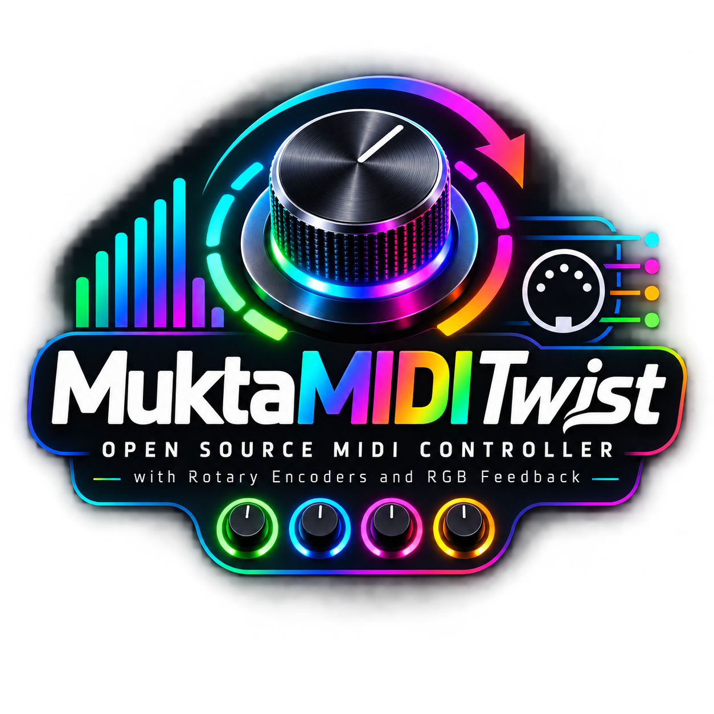

<p align="center">
  
  <br>
  <sub>© 2026 Richard Smetana · Logo generated with ChatGPT</sub>
</p>

# Mukta MIDI Twist

Arduino MIDI controller firmware for **four KY-040** rotary encoders with push buttons, plus **RGB LED feedback** (onboard WS2812 on GPIO 48 + external strip on GPIO 7) driven by incoming MIDI Note On / Note Off.

On **ESP32-S3**, MIDI runs over **native USB** (class-compliant USB MIDI device **“Mukta MIDI Twist”**). No serial↔MIDI bridge and no cable swapping for MIDI.

Target board: **YD-ESP32-S3** (VCC-GND Studio) or any **ESP32S3 Dev Module** with native USB on GPIO 19/20.

---

## Features

- Four KY-040 encoders polled in `loop()` (no interrupts — stable on ESP32-S3)
- Absolute and relative CC modes per encoder
- Four push buttons (momentary and/or latch)
- MIDI **receive**: Note On/Off → onboard RGB (GPIO 48) + external strip (GPIO 7, 4 pixels)
- Note On **velocity** sets channel brightness
- All GPIOs and MIDI maps in [`config.h`](config.h)

---

## Hardware

### Parts

| Part | Notes |
|------|--------|
| **ESP32-S3** | YD-ESP32-S3 recommended |
| 4× **KY-040** | CLK, DT, SW, +, GND each |
| **WS2812 strip** (optional) | 4× RGB, data on **GPIO 7** |
| **USB cable** | Native USB port (GPIO 19/20) — power, upload, MIDI |

### YD-ESP32-S3 solder bridges (underside)

| Bridge | Setting |
|--------|---------|
| **RGB** | **Closed** (onboard LED on GPIO 48) |
| **USB-OTG** | Open (device mode via firmware) |
| **IN-OUT** | Open (5 V pin = power input only) |

### GPIO wiring (current `config.h`)

| Signal | Enc 0 | Enc 1 | Enc 2 | Enc 3 |
|--------|-------|-------|-------|-------|
| **CLK** | **42** | **39** | **4** | **15** |
| **DT** | **41** | **38** | **5** | **16** |
| **SW** | **40** | **37** | **6** | **17** |
| **+** | 3.3 V | 3.3 V | 3.3 V | 3.3 V |
| **GND** | GND | GND | GND | GND |

| Function | GPIO | Notes |
|----------|------|--------|
| WS2812 strip data | **7** | `STRIP_PIN`, 4 LEDs, `NEO_RGB` |
| Onboard RGB | **48** | `RGB_BUILTIN`, bridge **RGB** closed |
| BOOT / upload | **0** | Hold **2 s** to enter bootloader |
| USB D− / D+ | **19 / 20** | Do not use as GPIO |
| UART0 (optional) | **43 / 44** | Serial monitor if needed |
| Strapping | **45 / 46** | Do not use as GPIO |

A compile-time check in `config.h` ensures all encoder and strip pins are unique.

### Reserved GPIOs (do not assign in `config.h`)

| GPIO | Reason |
|------|--------|
| 0 | BOOT button (upload trigger in firmware) |
| 19, 20 | Native USB |
| 45, 46 | Boot strapping |
| 48 | Onboard WS2812 (unless you disable onboard LED) |

### Free GPIOs on YD-ESP32-S3 header (for extensions)

Still available on the board headers: **1, 2, 3, 8, 9, 10, 11, 12, 13, 18, 21, 35, 36** (plus **43, 44** if UART0 is unused).

---

## Software setup

### 1. Install tools

1. [Arduino IDE](https://www.arduino.cc/en/software) 2.x (or Arduino CLI)
2. Board package: **esp32** by **Espressif Systems** (Board Manager)
3. Library: **Adafruit NeoPixel** (Library Manager — only for the external strip)

Recommended esp32 core version: **3.3.x** (tested with 3.3.11).

### 2. Open sketch

Open the folder `mukta-midi-twist` — the sketch name must match the folder name.

### 3. Arduino IDE — Tools menu

Set **every** value below before compiling or uploading:

| Tool (Werkzeug) | Setting | Why |
|-----------------|---------|-----|
| **Board** | **ESP32S3 Dev Module** | ESP32-S3 target |
| **USB Mode** | **USB-OTG (TinyUSB)** | Native USB MIDI (`ARDUINO_USB_MODE=0`) |
| **USB CDC On Boot** | **Disabled** | Pure MIDI device; **Enabled** breaks MIDI on Windows |
| **USB Firmware MSC On Boot** | Disabled | — |
| **USB DFU On Boot** | Disabled | — |
| **Upload Mode** | **USB-OTG CDC (TinyUSB)** | Upload via native USB |
| **CPU Frequency** | 240 MHz | Default |
| **Flash Mode** | QIO 80 MHz | Match module |
| **Flash Size** | **4 MB (32 Mb)** | Adjust if your module differs (e.g. 8 MB) |
| **Partition Scheme** | Default | — |
| **PSRAM** | Disabled / OPI | Match module (N8R8 → OPI PSRAM) |
| **Arduino Runs On** | Core 1 | Default |
| **Events Run On** | Core 1 | Default |
| **JTAG Adapter** | Disabled | Unless debugging with OpenOCD |
| **Upload Speed** | 921600 | Lower to 115200 if upload fails |

**Critical:** If **USB Mode** is **Hardware CDC and JTAG** or **USB CDC On Boot** is **Enabled**, Windows usually shows only a COM port and **no MIDI** in Sonic Pi / DAWs.

---

## One-time Arduino environment modification

After upload via **BOOT → USB JTAG**, the ESP32-S3 often **does not restart** into your sketch (esptool default: `--after hard-reset`).

### Install `platform.local.txt`

1. Copy [`platform.local.txt`](platform.local.txt) from this repo to:

   **Windows**
   ```
   %LOCALAPPDATA%\Arduino15\packages\esp32\hardware\esp32\3.3.11\platform.local.txt
   ```

   **macOS**
   ```
   ~/Library/Arduino15/packages/esp32/hardware/esp32/3.3.11/platform.local.txt
   ```

   **Linux**
   ```
   ~/.arduino15/packages/esp32/hardware/esp32/3.3.11/platform.local.txt
   ```

   Adjust `3.3.11` if your installed esp32 core version differs (check the folder name).

2. **Restart the Arduino IDE completely.**

3. Verify in the upload log: `--after watchdog-reset` appears **before** `write-flash` (not at the end of the command).

**Do not** use `boards.local.txt` with `upload.extra_flags=--after watchdog-reset` — that appends the flag after the `.bin` files and breaks esptool.

---

## Programming / upload procedure

There is **no COM port** while the MIDI sketch runs (`USB CDC On Boot: Disabled`). Upload always goes through the **ROM bootloader** (USB JTAG port).

### Every upload

1. Connect USB to the **native port** (GPIO 19/20), not a separate UART-only connector.
2. **Hold BOOT (GPIO 0) for 2 seconds** — firmware calls `usb_persist_restart(RESTART_BOOTLOADER)`.
   - Alternative: hold **BOOT**, tap **RST/EN**, release **BOOT**.
3. In Arduino IDE → **Port**: select **USB JTAG/serial debug unit (COMx)**.
4. Click **Upload** (✓).
5. Wait until the log shows **Done uploading**.
6. **Unplug and replug USB** once (Windows re-enumerates MIDI).
7. Restart Sonic Pi / your DAW and select **“Mukta MIDI Twist”**.

### What you should see in the upload log

```
USB mode: USB-Serial/JTAG
...
--after watchdog-reset write-flash ...
...
Done uploading.
```

`USB-Serial/JTAG` during upload is **normal** (bootloader mode). After replug, the device appears as a **MIDI instrument**, not as a COM port.

### First flash / erased chip

The very first upload after a full flash erase may still need one manual **BOOT + RST** cycle. After `platform.local.txt` is installed, later uploads should start the sketch without pressing RST.

### If upload fails

| Symptom | Fix |
|---------|-----|
| Port not found | BOOT 2 s → select **USB JTAG/serial debug unit** |
| `Could not open COMx` | Wrong port; do not use a stale “USB Serial Device” from an old composite firmware |
| Upload OK, no MIDI | **USB CDC On Boot** must be **Disabled**; replug USB; restart Sonic Pi |
| Upload OK, must press RST | Install [`platform.local.txt`](platform.local.txt); restart IDE |
| Compile warning CDC enabled | Set **USB CDC On Boot → Disabled** |

---

## MIDI usage (Sonic Pi / DAW)

1. Device name: **Mukta MIDI Twist**
2. Windows: Device Manager → **Sound, video and game controllers** (not **Ports COM & LPT**)
3. Sonic Pi: Preferences → I/O → enable **Mukta MIDI Twist** as input/output
4. Send notes **45–47** for onboard RGB, **48–59** for strip pixels (channel **1** by default)
5. Example test pattern: [`sonicpi/sonic-pi-01-led-test.txt`](sonicpi/sonic-pi-01-led-test.txt) — see [`sonicpi/README.md`](sonicpi/README.md)

---

## Configuration

Edit **[`config.h`](config.h)** only.

### GPIO summary

```cpp
// Encoders (CLK / DT / SW)
ENC0: 42 / 41 / 40
ENC1: 39 / 38 / 37
ENC2:  4 /  5 /  6
ENC3: 15 / 16 / 17

STRIP_PIN = 7        // external WS2812, 4 LEDs
Onboard RGB: GPIO 48 // RGB_BUILTIN, not in config.h
```

### Onboard RGB (GPIO 48)

| Channel | MIDI note |
|---------|-----------|
| Red | **45** |
| Green | **46** |
| Blue | **47** |

### External strip (GPIO 7, 4 pixels)

```
Pixel:  1   1   1   2   2   2   3   3   3   4   4   4
CH:     R   G   B   R   G   B   R   G   B   R   G   B
Note:  48  49  50  51  52  53  54  55  56  57  58  59
```

Strip color order: **NEO_RGB** in `leds.cpp` (change to `NEO_GRB` if red/green are swapped on your hardware).

Configure `LED_MIDI_CHANNEL`, `NEOPIXEL_BRIGHTNESS`, `LED_IDLE_TIMEOUT_SEC` (0 = no timeout) in `config.h`.

### Encoder MIDI (defaults)

| Encoder | Absolute CC | Relative CC |
|---------|-------------|-------------|
| 0 | 16 | 17 |
| 1 | 18 | 19 |
| 2 | 20 | 21 |
| 3 | 22 | 23 |

All on channel **1** by default. Toggle modes with `ENCn_ABSOLUTE_ENABLE` / `ENCn_RELATIVE_ENABLE`.

### Button notes (defaults)

| Button | Momentary | Latch |
|--------|-----------|-------|
| 0 | 60 | 68 |
| 1 | 61 | 69 |
| 2 | 62 | 70 |
| 3 | 63 | 71 |

---

## How it works

1. **`encoderUpdate()`** polls CLK/DT, decodes quadrature, counts detents.
2. **`encoderSendMidi()`** sends absolute and relative CC.
3. **`buttonProcessMidi()`** debounces buttons, sends note events.
4. **`midi_in`** receives USB MIDI for LED control.
5. **`loop()`** runs everything; no MIDI inside ISRs.

USB init (ESP32-S3): `usbMidi.begin()` → `USB.begin()` once in `setup()` — requires **USB CDC On Boot: Disabled**.

---

## Project layout

```
mukta-midi-twist/
├── logo/
│   ├── README.md              # logo copyright & usage
│   └── mukta-midi-twist.png   # project logo (shown in README)
├── sonicpi/                   # Sonic Pi test scripts (see sonicpi/README.md)
│   ├── README.md
│   └── sonic-pi-01-led-test.txt
├── config.h              # GPIOs + MIDI / LED maps
├── mukta-midi-twist.ino
├── platform.local.txt    # Copy to esp32 core (watchdog reset after upload)
├── midi.cpp / midi.h     # USB MIDI
├── midi_in.cpp / .h      # MIDI receive → LEDs
├── leds.cpp / leds.h     # Onboard + strip
├── encoder.cpp / .h
├── button.cpp / .h
└── README.md
```

---

## License

Firmware source code: **GNU General Public License v3.0** — see [LICENSE](LICENSE).

Project logo: **© 2026 Richard Smetana** (generated with ChatGPT) — see [logo/README.md](logo/README.md).

## Contributing

See [CONTRIBUTING.md](CONTRIBUTING.md).
